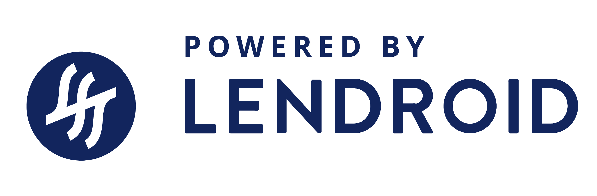

<b>Notice</b>

The Lendroid Protocol Rightshare Smart Contract(s) and its associated documentation and library files
namely rightshare.js (collectively &quot;Lendroid Protocol&quot;) shall only be accessed
through authorized channels. Any other means or channels for obtaining the Lendroid
Protocol in not recommended. Interested Parties are encouraged to use the following
channels to access: https://lendroid.com, https://rightshare.lendroid.com or https://github.com/lendroidproject/Rightshare-contracts.

The deployed smart contract is immutable, which means the creator or deployer cannot
change or modify in any manner. This is the nature of blockchain software, and is not
particular to this code.

The creators of this code have taken diligent efforts to keep it bug free. However, due to the
uncertain nature of blockchain software, there might be bugs discovered in the future. The
creators or deployers cannot fix these bugs and shall not be held liable for any losses that
might be incurred as a result.

The Lendroid Protocol is for educational and experimental purposes, and should not be used
for commercial purposes. Please seek professional advice before enabling the use of the
Lendroid Protocol for commercial reasons.

<b>License Terms</b>

Copyright &copy;2020 LENDROID FOUNDATION

Permission is hereby granted, free of charge, to any person obtaining a copy of the Lendroid
Protocol Rightshare Smart Contract(s) and associated documentation and Library files namely
rightshare.js (collectively &quot;Lendroid Protocol&quot;), to deal in the Lendroid Protocol without
restriction, including without limitation the rights to use, copy, modify, merge, publish, distribute,
sublicense, and/or sell copies of the Lendroid Protocol, and to permit persons to whom the
Lendroid Protocol is furnished to do so, subject to the following conditions:
1. The above copyright notice and the disclaimers in paragraphs 2 to 9 shall be included in
all copies or substantial portions of the Lendroid Protocol.
2. THE LENDROID PROTOCOL IS PROVIDED BY THE COPYRIGHT HOLDERS AND
CONTRIBUTORS (COLLECTIVELY THE “LICENSOR”) “AS IS” AND “WITH ALL
FAULTS” AND ANY EXPRESS OR IMPLIED WARRANTIES AND
REPRESENTATIONS, INCLUDING, BUT NOT LIMITED TO, THE IMPLIED
WARRANTIES OF MERCHANTABILITY AND FITNESS FOR A PARTICULAR
PURPOSE ARE DISCLAIMED. IN NO EVENT SHALL THE LICENSORBE LIABLE FOR
ANY DIRECT, INDIRECT, INCIDENTAL, SPECIAL, EXEMPLARY, OR
CONSEQUENTIAL DAMAGES (INCLUDING, BUT NOT LIMITED TO, PROCUREMENT
OF SUBSTITUTE GOODS OR SERVICES; LOSS OF USE, DATA, OR PROFITS; OR
BUSINESS INTERRUPTION) HOWEVER CAUSED AND ON ANY THEORY OF
LIABILITY, WHETHER IN CONTRACT, STRICT LIABILITY, OR TORT (INCLUDING
NEGLIGENCE OR OTHERWISE) ARISING IN ANY WAY OUT OF OR IN
CONNECTION WITH THE LENDROID PROTOCOL OR THE USE OR OTHER
DEALINGS IN THE LENDROID PROTOCOL, EVEN IF ADVISED OF THE POSSIBILITY
OF SUCH DAMAGE.

3. The Licensor has taken reasonably practicable measures to ensure the
effectiveness, usability and bug free nature of the Lendroid Protocol, however the
Licensor does not represent or warrant that (i) the Lendroid Protocol will meet
licensee’s or end user’s needs or requirements, (ii) the operation of the Lendroid
Protocol will be uninterrupted, timely, secure, continuous or free of defects, errors or
inaccuracies, (iii) the functions contained in the Lendroid Protocol will operate in all
the combinations which may be selected for use by licensee. (iv) the Lendroid
Protocol is secure or invulnerable to cyber-attacks, (v) the Lendroid Protocol will be
safe from unauthorised access, manipulation or interference, (vii) transactions using
the Lendroid Protocol (whether in whole or in part) howsoever and in whatever
manner will be processed in a timely manner, or will be processed accurately or
securely or, (ix) cryptocurrencies accessed, managed or transacted through or by the
Lendroid Protocol will not be lost or stolen; (x) the Lendroid Protocol will be available
or accessible at any given time, (xi) the Lendroid Protocol can be amended or
rectified after it has been deployed onto the Ethereum MainNet, and (xii) all
subsequent versions of the Lendroid Protocol deployed in the future will be
compatible with the current version licensed or error-free with if used concurrently.
4. The licensee agrees that the Lendroid Protocol is an experimental software and the
Licensor and its representatives, and anyone else involved in creating, producing or
delivering the Lendroid Protocol shall not be liable for any damage incurred: (i) when
the Lendroid Protocol is temporarily or permanently unavailable due to malfunction or
cessation of internet services by networks or underlying blockchain technology (ii)
due to abuse by licensee, end users or third parties, (iii) when there is any breach of
security by hackers or cyber-attackers (iv) due to any action or omission by licensee
or any end user, (v) in connection with the use or inability to use any cryptocurrency.

5. The licensee shall conduct its business and operations in compliance with all
applicable laws.
6. The licensee will indemnify, defend and hold the Licensor, its affiliates and
representatives harmless from and against all taxes, claims, damages, liabilities,
costs and expenses, and any and all losses resulting from: (i) allegations and claims
brought by third parties or end users directly or indirectly using the Lendroid Protocol,
(ii) allegations or claims by any third party, including any governmental authority, that
the licensee is not compliant with applicable laws, including any failure to comply with
or satisfy anti-money laundering laws, or securities laws. (iii) any third party
allegations or claims resulting from acts or omissions of licensee.
7. The licensee shall in no event be considered an employee, partner, joint venturer or
agent of the Licensor, notwithstanding any actions of either party or circumstances
arising in connection with the Lendroid Protocol. The licensee has no authority to and
will not exercise or hold itself out as having any authority to enter into or conclude
any contract or to undertake any commitment or obligation for, in the name of or on
behalf of the licensor. The licensee is prohibited from holding himself out as a
member of, or in any way participatory in, the Lendroid Foundation’s management.
8. This licensee shall reproduce or caused to be reproduced the following logo in a
conspicuous position on any publicity material (including websites and software
applications) which provide publicity for any of the licensee’s products which
incorporates the Lendroid Protocol:

All use of the Lendroid logo shall be in compliance with guidelines issued by the
Licensors from time to time.
9. If the licensee fails to comply with any of the licence terms, the licence will
terminate automatically, and the Licensor shall be entitled to damages and
compensation for the past and future use of the Lendroid Protocol by the licensee.
